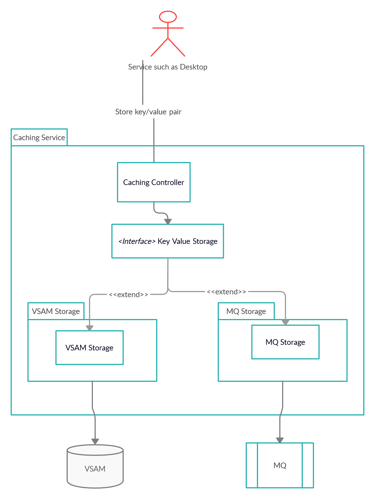

# Caching Service

To support the High Availability of all components within Zowe, components either need to be stateless, or offload the state to a location accessible by all instances of the service, including those which just started. At the current time, some services are not, and cannot be stateless. For these services, we introduce the Caching Service. 

The Caching Service aims to provide an API which offers the possibility to store, retrieve and delete data associated with keys. The service will be used only by internal Zowe applications and will not be exposed to the internet. The Caching Service needs to support a hot-reload scenario in which a client service requests all available service data. 

There are two production implementations offered directly by Zowe: VSAM storage running on Z and Redis running off Z. The other service providers may provide further storage solutions.  

## Architecture

Internal architecture needs to take into consideration, namely the fact that there will be multiple storage solutions. The API, on the other hand, remains the same throughout various storage implementations. 

## How to use

The Caching Service is built on top of the spring enabler, which means that it is dynamically registered to the API Mediation Layer. It appears in the API Catalog under the tile "Zowe Applications".

There are REST APIs available to create, delete, and update key-value pairs in the cache, as well as APIs to read a specific key-value pair or all key-value pairs in the cache.  

## Storage

There are multiple storage solutions supported by the Caching Service with the option to 
add custom implementation. [Additional Storage Support](#additional-storage-support) explains
what needs to be done to implement custom solution. 

### In Memory

This storage is useful for testing and integration verification. Don't use it in production. 
The key/value pairs are stored only in the memory of one instance of the service and therefore 
won't persist. 

### VSAM

VSAM is a first solution as a storage for running the Caching Service on Z (on platform). As the VSAM is specific for the zOS there is no way to run it in a standard development environment. To run this scenario the Caching Service needs to be deployed on platform. More information on how to achieve this is in the [Ad hoc mainframe Deployment](../docs/ad-hoc-mainframe-deployment.md)

Further documentation on how to use the VSAM are here
- https://docs.zowe.org/stable/extend/extend-apiml/api-mediation-vsam/
- https://docs.zowe.org/stable/extend/extend-apiml/api-mediation-caching-service/#vsam
- https://docs.zowe.org/stable/user-guide/configure-caching-service-ha/

#### Performance

Due to the Java access to the VSAM there are performance limitation to this approach. We have been testing in a few scenarios. 

Test process:
1) Load 1000 records into cache concurrently (5 threads)
2) Update all records for 120 seconds with increasing thread count, up to <x> amount of threads
3) Read all records for 120 seconds with increasing thread count, up to <x> amount of threads
4) Read and update all records for 120 seconds with increasing thread count, up to <x> amount of threads
5) Delete all loaded records from cache concurrently (5 threads)

Tests are run with 3 scenarios: 
Low load: 5 threads, Medium load: 15 threads, High load: 50 threads

Test subjects:
- Single Caching Service with VSAM storage
- Two Caching Services with shared VSAM storage

Results
- Most important operation is READ.
- Two Caching Services achieve better READ performance than a single CS.
- Based on data, the read performance seems acceptable, ranging from 300 ms to 1000 ms.
- With two Caching Services and high load, the read performance is significantly better.
- Response times of other operations are also acceptable, yet error rates increase with higher concurrency.
- Two Caching Services produce higher load on shared resource (VSAM) and have higher error rate.
- It seems to us that for user-based workloads, the VSAM implementation will suffice. For light automation workloads it might be acceptable as well. For heavy workloads it might not be enough.
- VSAM does not scale very well beyond 1000 RPM on a node.

### Redis

Redis is another valid option for the storage to use. The main goal for Redis is the running of the storage, and the Caching Service off platform. 

For development the repository contains docker compose scripts. There are two setups provided.  

1) redis/docker-compose-replica.yml - Starts two containers in master/replica setup.
2) redis/docker-compose-replica-tls - Starts two containers in master/replica setup with TLS enabled.
3) redis/docker-compose-sentinel.yml - Starts five containers. Master, replica and three sentinels to coordinate in case sentinel fails.
4) redis/docker-compose-sentinel-tls.yml - Starts five containers. Master, replica and three sentinels to coordinate in case sentinel fails. TLS is enabled.

The first setup works well for testing. In order to properly configure the Caching Service following configuration is needed either in application.yml in the Caching Service or passed in via command line parameters.

    caching:
        storage:
            mode: redis
            redis:
                host: localhost
                port: 6379
                username: default
                password: heslo
                
 In order to enable TLS, the following configuration is required:
 
    caching:
         storage:
             mode: redis
             redis:
                 host: localhost
                 port: 6379
                 username: default
                 password: heslo
                ssl:
                    enabled: true
                    keyStore: ${server.ssl.keyStore}
                    keyStorePassword: ${server.ssl.keyStorePassword}
                    trustStore: ${server.ssl.trustStore}
                    trustStorePassword: ${server.ssl.trustStorePassword}
                 
 In order to connect to sentinel, the following configuration can be used:
 
     caching:
         storage:
             mode: redis
             redis:
                 host: localhost
                 port: 6379
                 username: default
                 password: heslo
                 sentinel:
                     master: redismaster
                     nodes:
                         - host: localhost
                           port: 26379
                           password: sentinelpassword
                         - host: localhost
                           port: 26380
                           password: sentinelpassword
                         - host: localhost
                           port: 26381
                           password: sentinelpassword
                           
The library used to connect to Redis, Lettuce, uses node registration information to automatically discover instances downstream from
the master (in master/replica topology) or the sentinels (in sentinel topology). This means the IP address used to connect from the Caching Service
is the IP address used to register, which with the above docker compose files is the container IP address. This means the Caching Service tries to
connect using the container IP address, which does not resolve properly. The ports are published, however, so if the container IP addresses are aliased
to localhost, the Caching Service can connect. Another option, if running on Linux, is to use a host network in the docker compose file.

### Additional Storage Support

To add a new implementation it is necessary to provide the library with the implementation
of the Storage.class and properly configure the Spring with the used implementation. 

    @ConditionalOnProperty(
        value = "caching.storage",
        havingValue = "custom"
    )
    @Bean
    public Storage custom() {
        return new CustomStorage();
    }

The example above shows the Configuration within the library that will use different storage than the default InMemory one. 

It is possible to provide the custom implementation via the -Dloader.path property provided on startup of the Caching Service. 

## How do you run for local development

The Caching Service is a Spring Boot application. You can either add it as a run configuration and run it together with other services, or the npm command to run API ML also runs the caching service with in memory storage. 

Command to run full set of api-layer: `npm run api-layer`. If you are looking for the Continuous Integration set up run: `npm run api-layer-ci`

In local usage, the Caching Service will run at `https://localhost:10016`. The API path is `/cachingservice/api/v1/cache/${path-params-as-needed}`.
For example, `https://localhost:10016/cachingservice/api/v1/cache/my-key` retrieves the cache entry using the key 'my-key'.

## Personal access token revocation store

When personal access tokens are enabled, ZAAS keeps their revocation state here, under three maps:
`invalidTokens` (one entry per revoked token), `invalidUsers` and `invalidScopes` (one entry per revocation
rule). Only the Infinispan backend supports this - `inMemory`, `redis` and `VSAM` reject every map operation,
and `PATAuthSourceService` fails closed, so personal access token authentication does not work on them at all.

Each item is one cache entry, in `zoweInvalidatedTokenItemCache`, with its own expiration:

* A revocation is a single `put`. It takes no cluster-wide lock, replicates only that one entry, and costs the
  same whether the store holds ten entries or a million.
* Expiration is Infinispan's own, computed per entry by ZAAS - the token's remaining life for a token, 90 days
  for a rule. Nothing has to run on a timer to keep the store from growing.
* Asking "is this token revoked?" is a point lookup of the token hash, the user hash and one key per scope,
  through `POST /cachingservice/api/v1/cache-query`, instead of a download of the whole store.

### Endpoints

| Endpoint | Purpose |
|---|---|
| `POST /cachingservice/api/v1/cache-list/{mapKey}` | add or replace one item of a map |
| `POST /cachingservice/api/v1/cache-query` | look up specific items across maps; returns only what exists |
| `GET /cachingservice/api/v1/cache-list` | every item of every map. Deprecated: cost grows with the store |
| `GET /cachingservice/api/v1/cache-list/{mapKey}` | every item of one map. Deprecated, same reason |
| `GET /cachingservice/api/v1/cache-list-legacy` | the pre-cutover layout only. Removed once every token issued before the upgrade has expired |
| `DELETE /cachingservice/api/v1/cache-list/evict/tokens/{mapKey}` | drop expired token records. A safety net; expiration is automatic |
| `DELETE /cachingservice/api/v1/cache-list/evict/rules/{mapKey}` | drop rules past their retention. Likewise |

`cache-query` takes the keys to look up grouped by map, and answers with only the entries that exist - a map
with nothing found is omitted from the response entirely:

    POST /cachingservice/api/v1/cache-query
    {"invalidTokens": ["<hash>"], "invalidUsers": ["<hash>"], "invalidScopes": ["<hash>", "<hash>"]}

A read expressed as a POST is unidiomatic, but each key is a 128-character hash and a multi-scope token needs
several of them, which does not fit a URL reliably. The number of keys per request is bounded by
`caching.storage.maxQueryKeys`; that bound has to stay at least two above the scope cap ZAAS applies at
issuance (`apiml.security.personalAccessToken.maxScopes`), because a rejected lookup makes a token
unauthenticatable rather than merely slow.

### Retiring the pre-cutover store

The previous layout kept a whole map as the value of a single cache entry, in `zoweInvalidatedTokenCache`.
From this release on that cache is frozen: nothing writes to it, and it is read only for personal access
tokens that were issued before the upgrade. It cannot grow, and within 90 days nothing reads it at all.

Removing a cache definition does not remove its data. Each persistent cache is a directory
`<workspace>/caching-service/<haInstanceId>/<cacheName>/`, and with the default 256 segments even an empty one
costs about a megabyte across 258 index files. Whether to dispose of it is an operator decision, so the
product ships a script rather than deleting anything:

    bin/retire-cache.sh --list                       # what is there, and how big
    bin/retire-cache.sh zoweInvalidatedTokenCache    # rename it aside (reversible)
    bin/retire-cache.sh zoweInvalidatedTokenCache --delete

The service must be stopped: Infinispan holds open handles into the directory, and moving it underneath a
running instance corrupts the store rather than retiring it. `zoweCache` is refused outright - it holds the
hashing salt, and losing that silently un-enforces every revocation there is.

There are two moments to run it, with different consequences, and the script cannot tell them apart:

* **Any time after the upgrade.** Reclaims the disk at once and puts every request on the fast path
  immediately. The cost, plainly: **every revocation made before the upgrade stops being enforced** - a
  pre-upgrade token that was revoked works again until it expires on its own. Re-revoke what still matters.
* **More than 90 days after the upgrade**, or after the release that removes the pre-cutover read path. No
  consequence at all: nothing reads the directory any more and every token it could apply to has expired.

Keeping the directory costs disk only. The same script also reclaims directories left behind by caches that
have since been renamed or made non-persistent, which is worth doing independently of personal access tokens.

## Configuration properties

The Caching Service uses the standard `application.yml` structure for configuration.

`apiml.service.routes` only specifies one API route as there is no need for web socket or UI routes.
`caching.storage` this property is reserved for the setup of the proper storage within the Caching Service. 
