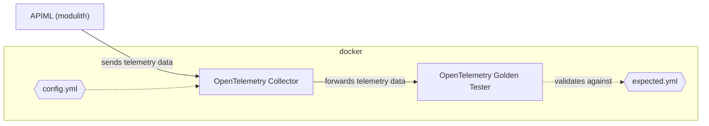

# OpenTelemetry containers for integration testing

The [docker-compose.yml](docker-compose.yml) defines 2 containers:

- OpenTelemetry Collector (oallector)
- OpenTelemetry Golden Validator (golden)

The collector is the standard OpenTelemetry Collector ([docs](https://opentelemetry.io/docs/collector/), [repo](https://github.com/open-telemetry/opentelemetry-collector-contrib)). The Golden Tester comes from the [same](https://github.com/open-telemetry/opentelemetry-collector-contrib/tree/main/cmd/golden) repository and validates data exported from the collector. Only metrics (in [alpha](https://github.com/open-telemetry/opentelemetry-collector/blob/main/docs/component-stability.md#alpha) stability level) are supported as of January 2026; check for the exact version in the [docker-compose.yml](docker-compose.yml) and updates in the project repository.

## Integration test flow

The API Mediation Layer produces telemetry data that is exported to the Collector. Then the Collector exports the data to the Golden Tester in the same way as the data is published to an observability stack in a real deployment. The Golden Tester validates the telemetry data against a definition from yaml file. If the validation does not pass within a timeout the container exits with exit code 1.



The Golden Tester validates all metrics received, which makes definition of expected data difficult as the definition needs to be exhaustive. For this reason the OpenTelemetry collector is configured to produce at most one metric for validation, check the collector configuration file [otel-collector/config.yml](otel-collector/config.yml), which is mounted to the collector docker image.

The Golden Tester configuration is split into 2 parts:

- Configuration of the tester like timeout, ports, fields to ignore, etc. is done via cli arguments. CLI arguments for the golden binary are placed in the [docker-compose.yml](docker-compose.yml) file. The list of supported options can be found in the [golden binary sources](https://github.com/open-telemetry/opentelemetry-collector-contrib/blob/main/cmd/golden/internal/config.go).
- The definition of expected observability data is in [otel-golden/expected.yml](otel-golden/expected.yml).

There are 2 shell scripts to operate the integration test:

- [sh/start_containers.sh](sh/start_containers.sh) - starts the docker containers
- [sh/validate_and_stop.sh](sh/start_containers.sh) - to validate the test result, save containers log and exit the containers

### Definition of the expected telemetry data for validation
The `expected.yml` file for the Golden tester can be either created manually, or generated. To generate the file remove the existing `expected.yml` file, and add the following line to the Golden container startup arguments in the [docker-compose.yml](docker-compose.yml):

```yml
        "--write-expected" # generates the expected definition file from received data
```

Then run the integration test as usual. Instead of data validation, the Golden tester will create the `expected.yml` file to match the data received during the test. It is recommended to verify and manually edit the generated file if needed.

### Golden Tester configuration considerations

Ideally, we want to have a generic docker-compose file and configuration injected via mounted configuration files or environment variables. Unfortunately, the golden binary accepts only CLI arguments (except the definition of expected data), which makes externalizing the configuration difficult.

Every CLI argument that requires a value is processed as 2 distinct arguments by the golden binary. Given the fact, that the [official golden docker image](https://github.com/open-telemetry/opentelemetry-collector-contrib/pkgs/container/opentelemetry-collector-contrib%2Fgolden) is build from the [scratch base](https://github.com/open-telemetry/opentelemetry-collector-contrib/blob/main/cmd/golden/Dockerfile), there is no shell inside the golden image that preprocess the cli arguments so the arguments are passed to the binary exactly as defined in the [docker-compose.yml](docker-compose.yml) file.

For instance if your docker file contains:

```Dockerfile
    command: 
        - "--ignore-resource-attribute-value process.pid"
```

the whole string is passed to the binary and thus never matches the argument in the binary resulting in the value being ignored. The argument and value must be passed as two arguments:

```Dockerfile
    command: [ 
        "--ignore-resource-attribute-value", "process.pid"
        ]
```

When environment variables are used to pass values to the docker files, the whole environment variable value is passed as a single argument value. Unfortunately, this is not usable for the `--ignore-resource-attribute-value` as they must be repeated for every single value to be ignored.

Possible workarounds for future enhancements are:

- Use Docker multi-stage build to create a custom Golden Tester image with a shell. The shell parses the string arguments on white spaces and pass them as individual arguments to the binary. Then multiple arguments can be defined in an environment variable:

    ```Dockerfile
        GOLDEN_IGNORE_FIELDS = "--ignore-resource-attribute-value service.instance.id --ignore-resource-attribute-value host.name --ignore-resource-attribute-value host.arch --ignore-resource-attribute-value process.pid"
    ```

    and the variable used as a placeholder in the docker compose `command`.

- Add the arguments to the `docker compose run` command:

    ```shell
        $ docker compose run --rm --service-ports golden ----ignore-resource-attribute-value service.instance.id --ignore-resource-attribute-value host.name --ignore-resource-attribute-value host.arch --ignore-resource-attribute-value process.pid  
    ```

Note that `docker compose` cli arguments override the `command` value in the docker file, and the containers must be started individually in comparison to the simple `docker compose up`.

## Local run for development

To run the docker containers locally with the same setup as used in the integration tests, just run `docker compose up` (optionally with `-d`), or the scripts in the [sh](sh) directory, and then start the APIML modulith with the OpenTelemetry enabled. The signals received and exported by the collector are saved to the [otel-golden](otel-golden) folder. The Golden Tester exits after timeout reporting the result of validation in the container console/log. The timeout can be set in the [docker-compose.yml](docker-compose.yml) file.
